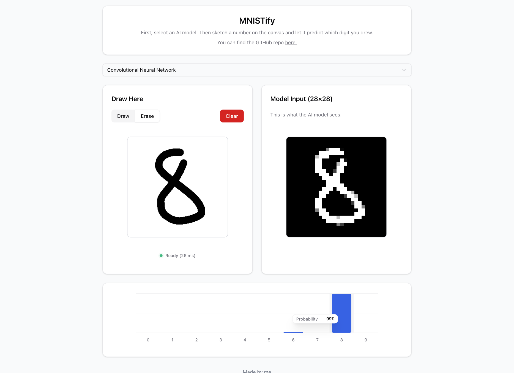

# Mnistify



Live demo: https://mnistify.vercel.app

## Aperçu

Bienvenue sur Mnistify, un petit projet qui rend le machine learning amusant et accessible directement dans ton navigateur. Le but était de créer une expérience interactive où tu peux jouer avec la reconnaissance de chiffres (dataset MNIST) en utilisant différents modèles de deep learning.

Tout se passe côté client grâce à WebGPU - donc pas de serveur coûteux, juste ton GPU qui travaille !

## Fonctionnalités

🎨 **Interface intuitive**

- Dessine tes propres chiffres
- Visualisation en temps réel des prédictions

📊 **Visualisation des performances**

- Graphiques interactifs des prédictions
- Visualisation de l'entrée du model
- Comparaison des temps d'inférence entre modèles

🔄 **Modèles disponibles**

- MLP (Multi-Layer Perceptron) : rapide et léger
- CNN (Convolutional Neural Network) : plus précis

## 🚀 Tech Stack

### 🎯 Frontend

- **[React](https://react.dev/)** – Bibliothèque JavaScript.
- **[Next.js](https://nextjs.org/)** – Framework React pour applications web.
- **[shadcn/ui](https://ui.shadcn.com/)** – Bibliothèque de composants UI.
- **[Tailwind CSS](https://tailwindcss.com/)** – Framework CSS.
- **[Recharts](https://recharts.org/)** – Bibliothèque de visualisation de données basée sur React.

### 🧠 Machine Learning

- **[Python 3.13.4](https://docs.python.org/3.13/)**
- **[TinyGrad](https://github.com/tinygrad/tinygrad)** – Framework de deep learning.
- **[WebGPU](https://www.w3.org/TR/webgpu/)** – API pour inférence côté client.
- **[SafeTensors](https://huggingface.co/docs/safetensors/index)** – Format sécurisé pour le partage de modèles.

## Résumé des modèles

### Modèle utilisé pour le MLP

| Type de couche | Détails                            |
| -------------- | ---------------------------------- |
| Entrée         | 784 neurones (image aplatie en 1D) |
| Couche dense 1 | 512 neurones avec activation SiLU  |
| Couche dense 2 | 512 neurones avec activation SiLU  |
| Sortie         | 10 neurones                        |

| Batch | LR   | Steps | LR Decay | Patience |
| ----- | ---- | ----- | -------- | -------- |
| 4096  | 0.02 | 1000  | 0.9      | 50       |

**Précision finale** : 99.14%

### Modèle utilisé pour le CNN

| Type de couche | Détails                                   |
| -------------- | ----------------------------------------- |
| Entrée         | Image 1 canal (28×28 pixels)              |
| Convolution 1  | 32 filtres de taille 5×5, activation SiLU |
| Convolution 2  | 32 filtres de taille 5×5, activation SiLU |
| Normalisation  | Normalisation par lots (32 canaux)        |
| Pooling        | Max-pooling (réduction de taille)         |
| Convolution 3  | 64 filtres de taille 3×3, activation SiLU |
| Convolution 4  | 64 filtres de taille 3×3, activation SiLU |
| Normalisation  | Normalisation par lots (64 canaux)        |
| Pooling        | Max-pooling (réduction de taille)         |
| Aplatissement  | Conversion en vecteur 1D                  |
| Couche dense   | 576 neurones vers 10 neurones             |

| Batch | LR    | Steps | LR Decay | Patience |
| ----- | ----- | ----- | -------- | -------- |
| 256   | 0.005 | 500   | 0.9      | 50       |

**Précision finale** : 99.25%

### Réflexions sur les tests et recherches

De nombreux tests et recherches ont été réalisés pour le CNN. Au final, sur un dataset aussi petit, le MLP avec de bons paramètres (facilement trouvables) s'avère tout aussi performant tout en étant moins gourmand en ressources à l'entraînement. Les architectures de CNN testées proviennent de propositions d'architectures générées par des LLM. Nous avons commencé par une recherche exhaustive (grid search), mais celle-ci s'est révélée trop coûteuse en temps et en ressources. Nous sommes donc passés à une approche _forced+random search_, bien qu'il existe d'autres méthodes qui auraient pu être plus adaptées. Dans une démarche scientifique, il aurait été plus judicieux d'évaluer l'impact de chaque paramètre individuellement au lieu d'utiliser le random search, afin de comprendre pleinement l'influence de chaque hyperparamètre et tendre vers un optimum.

### Journal d'hyperparamètres

Voir [`HYPERPARAMETERS-CNN.md`](/HYPERPARAMETERS-CNN.md) pour les détails de l'entraînement du CNN.
Voir [`HYPERPARAMETERS-MLP.md`](/HYPERPARAMETERS-MLP.md) pour les détails de l'entraînement du MLP.

## Installation & exécution locale

Pré-requis

- Node.js (recommandé >= 18)
- Python 3.9+ (si vous voulez ré-entraîner les modèles)
- Un environnement WebGPU compatible (navigateur récent Chrome/Edge/Firefox Nightly avec drapeau WebGPU si nécessaire)

Frontend

```bash
# à la racine du projet
npm install
npm run dev
```

Ouvrez http://localhost:3000 pour voir l'application.

Exemple pour un entraînement du CNN :

```bash
cd python
python -m pip install -r requirements.txt
python train_model.py --model cnn
```

```bash
python train_model.py -h
```

Pour avoir le détails des options possibles.
